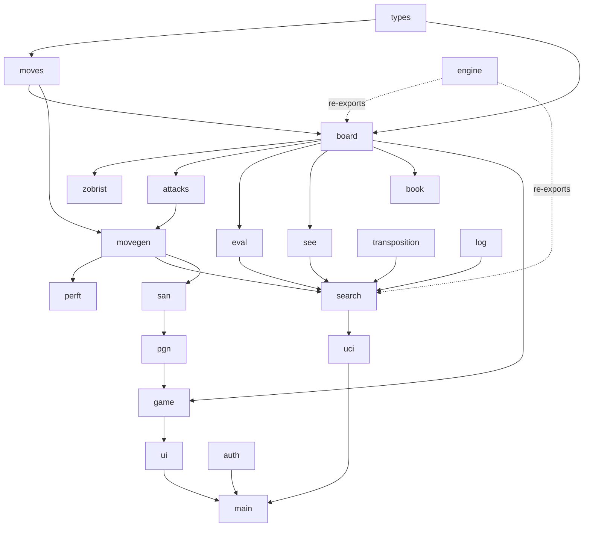

# Architecture

This document explains how the engine is put together: the module layering, the
core data structures, and the algorithms that make it correct and reasonably
strong. For a feature list and usage, see [`README.md`](README.md).

## Design goals

1. **Correctness first.** Every rule is verified: move generation by perft to
   100M+ nodes, special moves and draw rules by targeted tests, the evaluation
   by a color-symmetry proof, make/unmake by random-game fuzzing.
2. **Clean layering.** Small modules with one responsibility each; lower layers
   never depend on higher ones.
3. **No `unsafe`, no chess-logic dependencies.** Only `rand` (Zobrist seeding)
   and `sha2` (password hashing for the UI login) are used.

## Module dependency graph



## The board: `0x88`

Squares live in a 128-entry array. A square index splits into `rank = idx >> 4`
and `file = idx & 7`. The validity test is a single mask:

```
on_board(idx)  ==  (idx & 0x88) == 0
```

Any move that "wraps" off an edge sets a bit in `0x88`, so off-board
destinations, including diagonal pawn-capture wraps, are rejected by one
bitwise-and with no branching on file/rank. All square arithmetic is done on
signed `i32` with `on_board_i32`, so nothing ever underflows or panics.

## Make / unmake + incremental Zobrist

The search visits millions of nodes, so the board is **mutated in place** rather
than cloned. `make_move_struct` pushes a compact `Undo` record capturing exactly
what is needed to restore the previous position bit-for-bit:

```
Undo { mv, moved, captured, captured_sq,
       prev_castling, prev_ep, prev_halfmove,
       prev_fullmove, prev_side_white, prev_key }
```

`unmake_move` pops it and reverses the board edits (including the rook hop for
castling and the displaced pawn for en passant). The 64-bit Zobrist `key` is
updated **incrementally** during each make (XORing out the mover, any captured
piece, and the changed castling/ep/side keys) and is verified against a
from-scratch hash by `debug_key_ok()` in the fuzz tests.

Special-move semantics are *derived from the position at apply time* rather than
stored on the `Move`, which keeps `Move` tiny (`from`, `to`, optional promotion)
and lets the UI build moves trivially.

```
        make_move_struct(mv)                 unmake_move()
   ┌──────────────────────────┐         ┌──────────────────────────┐
   │ detect ep / castle / cap │         │ pop Undo                 │
   │ XOR piece keys (out/in)  │         │ reverse rook hop         │
   │ move rook if castling    │   ──▶   │ restore mover + captured │
   │ update castling/ep/clock │         │ restore scalars + key    │
   │ flip side, push Undo+key │         │                          │
   └──────────────────────────┘         └──────────────────────────┘
```

## Move generation

Two stages keep it simple and provably correct:

1. `gen_pseudo` enumerates pseudo-legal moves (legal except possibly leaving the
   king in check). Castling is fully validated here (rights, an empty path, the
   rook present, and the king not moving out of / through / into check) because
   the squares the king *passes over* are not covered by the later king-safety
   filter.
2. `legal_moves` makes each pseudo-legal move and keeps it only if the moving
   side's king is not attacked, then unmakes it.

`gen_captures` is the loud-move subset (captures, en passant, promotions) used by
quiescence. Correctness is pinned by [`tests/perft.rs`](tests/perft.rs).

## Search

`search.rs` implements iterative-deepening negamax with these components:

- **Principal Variation Search**: first move searched with a full window, the
  rest with a zero-window scout, re-searched on a fail-high.
- **Transposition table**: direct-mapped buckets with depth/age replacement;
  cutoffs reuse stored bounds and the stored move seeds ordering. Mate scores are
  corrected for distance-to-root on store/probe so faster mates win.
- **Quiescence**: at the leaves, resolves captures (ordered by SEE) and prunes
  captures with `SEE < 0`.
- **Null-move pruning**: give the opponent a free move at non-PV nodes with
  spare material; a fail-high means a near-certain cutoff.
- **Late-move reductions**: search late, quiet moves shallower, re-searching
  only the ones that beat alpha.
- **Move ordering**: TT move, then SEE/MVV-LVA captures, then killer moves and
  the history heuristic.
- **Aspiration windows**: narrow `(α, β)` around the previous score, widening
  on a fail.
- **Time management**: a deadline polled every 2048 nodes; the best completed
  line is always returned.

## Static Exchange Evaluation (SEE)

`see.rs` answers "if this capture is met by optimal recaptures, what do I net?"
using the classic swap-off: repeatedly bring the least-valuable attacker of the
target square to bear, alternating sides, then fold the gain array back with
negamax. X-ray attackers are handled because each step re-scans the (vacated)
occupancy. SEE only affects *strength*: a wrong SEE can never cause an illegal
move.

## Evaluation

`eval.rs` is a **tapered** evaluation: a middlegame and an endgame score are
accumulated from the PeSTO piece-square tables and blended by the remaining
material ("game phase"). Added on top: bishop pair, doubled/passed pawns,
mobility, king pawn-shield, and rook-on-(semi-)open-file. Every term is computed
symmetrically for both colors, and an invariant test asserts
`eval(pos) == -eval(mirror(pos))` over hundreds of positions, guaranteeing no
color bias.

## Protocols & application

- `uci.rs` speaks UCI so the engine drops into any GUI. `handle_line` is a pure
  function over a writer, which makes the protocol unit-testable.
- `san.rs` / `pgn.rs` render and parse human notation; the SAN parser works by
  rendering every legal move and matching, so printer and parser can never drift.
- `game.rs` is a high-level façade (`play`, `undo`, `redo`, `status`, `to_pgn`)
  that keeps the board and move list in lock-step.
- `ui/` is the interactive colored terminal app; `auth.rs` is its login layer.

## Testing strategy

| Layer | How it is verified |
| --- | --- |
| Move generation | Perft to depth 6 (119M+ nodes) on 6 reference positions |
| Make/unmake & keys | Random-game fuzzing asserts reversibility + incremental-key integrity |
| Rules | Targeted tests: ep timing/pins, castling rights, promotion, draws, FEN |
| Search | Tactical suite (mate-in-1/2, win material, avoid losing capture, promote) |
| Evaluation | Color-symmetry invariant over hundreds of positions |
| Notation/IO | SAN render/parse + PGN round-trip; UCI command tests |
| Performance | Criterion benchmarks for movegen, perft, eval, search |
